# wavy-bavy — Phase 1 Complete 🌊

## What Was Built

A complete React library for seamless wave transitions between page sections, located at `d:\TMM\wavy-bavy`.

### Architecture Overview

```mermaid
graph TD
    A["WaveProvider"] --> B["WaveSection (×N)"]
    B --> C["WaveRenderer (SVG)"]
    B --> D["WaveLayer (multi-layer)"]
    B --> E["Context Registration"]
    E --> F["Adjacent Section Detection"]
    F --> G["Auto Color Matching"]
    G --> C
```

### Files Created

| File | Purpose | Size |
|------|---------|------|
| [types.ts](file:///d:/TMM/wavy-bavy/src/types.ts) | All interfaces (288 lines) | Core |
| [constants.ts](file:///d:/TMM/wavy-bavy/src/constants.ts) | Patterns, presets, defaults | Core |
| [WaveProvider.tsx](file:///d:/TMM/wavy-bavy/src/context/WaveProvider.tsx) | Context + debug overlay | Context |
| [useWaveContext.ts](file:///d:/TMM/wavy-bavy/src/context/useWaveContext.ts) | Hooks (required + optional) | Context |
| [WaveSection.tsx](file:///d:/TMM/wavy-bavy/src/components/WaveSection.tsx) | Main wrapper component | Component |
| [WaveRenderer.tsx](file:///d:/TMM/wavy-bavy/src/components/WaveRenderer.tsx) | SVG renderer + filters | Component |
| [WaveLayer.tsx](file:///d:/TMM/wavy-bavy/src/components/WaveLayer.tsx) | Multi-layer stacking | Component |
| [color-utils.ts](file:///d:/TMM/wavy-bavy/src/utils/color-utils.ts) | Color parsing, interpolation | Utility |
| [path-generator.ts](file:///d:/TMM/wavy-bavy/src/utils/path-generator.ts) | SVG path generation | Utility |
| [index.ts](file:///d:/TMM/wavy-bavy/src/index.ts) | Public API barrel file | Export |

### Build Results

- **TypeScript**: 0 errors (strict mode)
- **ESM**: `dist/index.mjs` — 21.77 KB
- **CJS**: `dist/index.js` — 22.55 KB
- **DTS**: `dist/index.d.ts` — 12.75 KB

## Key Features Implemented

1. **Auto Section Registration** — `WaveSection` registers with `WaveProvider` via context
2. **Adjacent Detection** — `getSectionBefore()`/`getSectionAfter()` finds neighbors
3. **Color Matching** — Background parsing extracts dominant color for wave fills
4. **4 Pattern Generators** — smooth, organic, sharp, mountain (+ custom/layered)
5. **6 Presets** — hero, footer, dark-light, dramatic, subtle, angular, peaks
6. **Effects** — Shadow + glow (SVG filters), multi-layer depth
7. **Debug Overlay** — Shows registered sections with color swatches

## Next Steps (Phase 2)

- [ ] Animation system (flow, pulse, morph, ripple)
- [ ] `flipPathVertically` implementation  
- [ ] Clip-path for background images
- [ ] Tailwind CSS plugin
- [ ] Unit tests with vitest
- [ ] Playground/demo page
